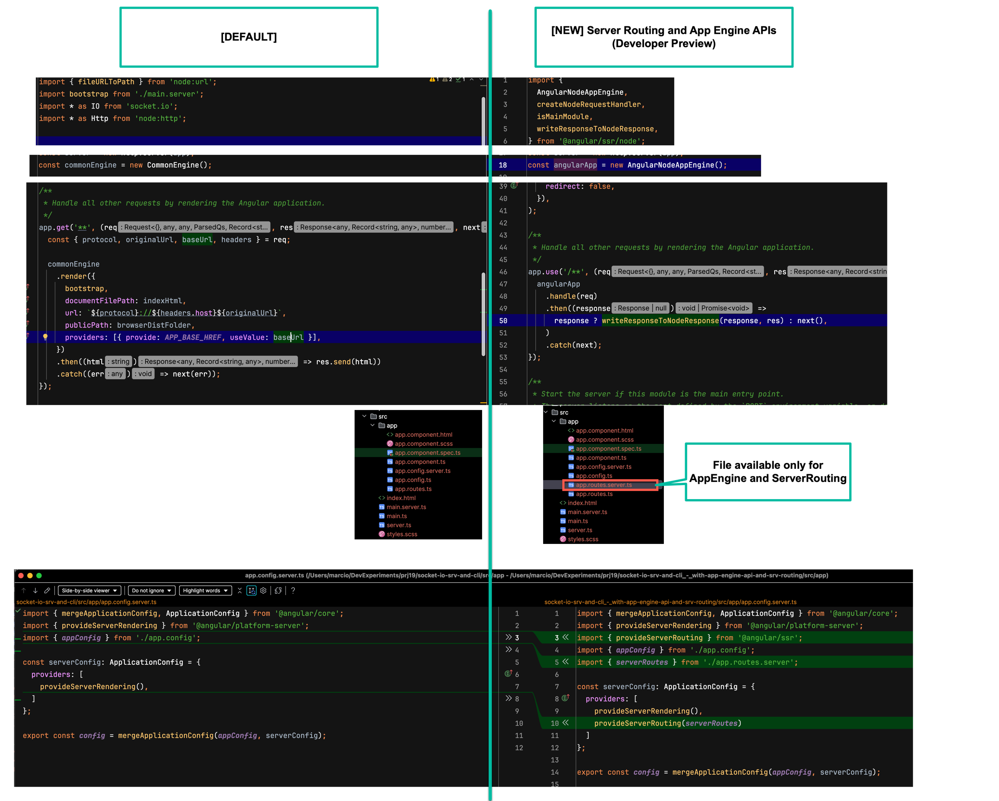

# Angular 19

## Server Routing and App Engine APIs (Developer Preview)

- It's 5th February and when you start an angular 19 project you have the option to
  
  ```
  ✔ Do you want to enable Server-Side Rendering (SSR) and Static Site Generation (SSG/Prerendering)? Yes
  ✔ Would you like to use the Server Routing and App Engine APIs (Developer Preview) for this server application? Yes
  ```

What's the difference between a project with `Server Routing and App Engine APIs = Yes` and a `No`

Here's the comparison: 


