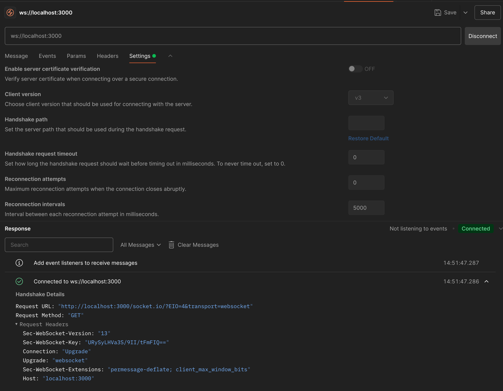

# Sample express + socket.io server

Postman connection test: Notice that `path` was intentionally left blank which defaults to `/socket.io`.
But you can enter `/socket.io` too or a custom path if you have set `path` property upon server initialisation. 

