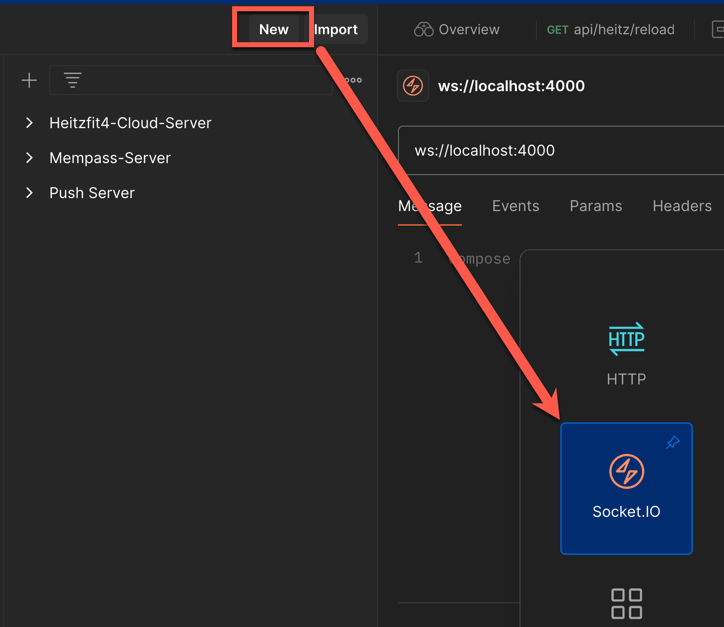

# Angular SSR + Socket.io 

This application was initialised with the following settings
```
$ npx ng new apptest

✔ Which stylesheet format would you like to use? Sass (SCSS)     [ https://sass-lang.com/documentation/syntax#scss                ]
✔ Do you want to enable Server-Side Rendering (SSR) and Static Site Generation (SSG/Prerendering)? Yes
✔ Would you like to use the Server Routing and App Engine APIs (Developer Preview) for this server application? Yes
```


### Getting started (development)

- Pull the project
- `cd` into this folder

Now run:    
 
```
$ npm install
$ npm run build
$ npm run ssr

You should see: 
  HTTP server listening on http://localhost:4000
```

So we have the "ng serve" running on port 4200 and our server running on 4000.
Then we use a proxy to forward requests (proxy.conf.json) to that server.


```
if (isMainModule(import.meta.url)) {
   // this code only run if server is our starter file. 
   // ng serve doesn't use it.  
}
```

### Bonus: Testing connection using `postman` 





> Make sure to properly setup the path if have customised it on your server. Default is /socket.io 


